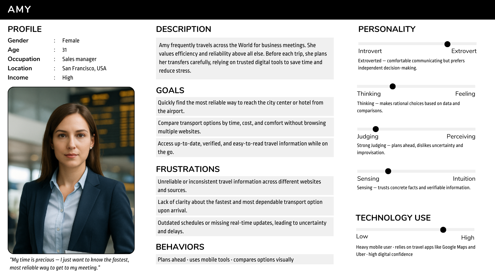
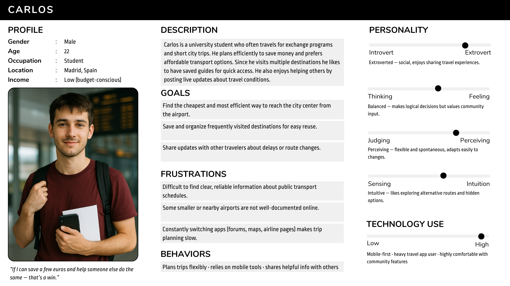
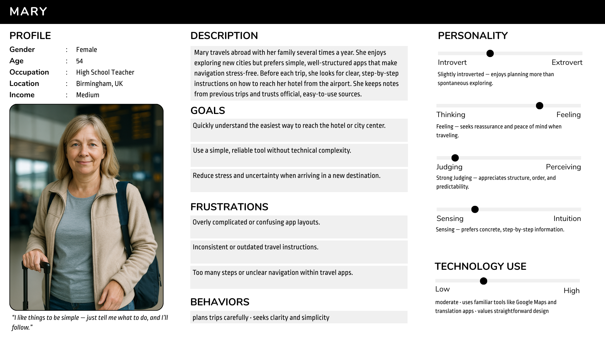
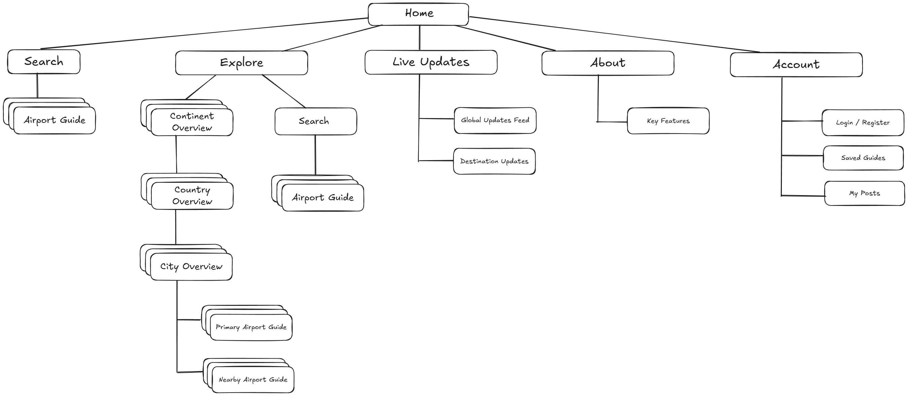

# 1. Personas
To better understand the needs, goals, and behaviors of potential users, several **personas** were developed based on typical travel scenarios relevant to the Air2City platform.

Each persona represents a different user group with distinct motivations — from **frequent travelers** looking for efficiency, to **budget-conscious students** and **casual tourists** seeking clear and reliable guidance.
These personas serve as a foundation for designing features, information flow, and interface elements that align with real user expectations.

### #1 Amy – Business Traveler

### #2 Carlos - Student Traveler

### #3 Mary – Tourist Traveler

# 2. Card Sorting & Information Architecture (IA)
The **information architecture** defines the hierarchical organization of content within Air2City.

It reflects the results of the **card sorting** exercise done by LLM (one that did not have any  previous context regarding the app apart from the cards it was given), grouping features into four main areas:
**Explore**, **Live Updates**, **My Account** and **About**.
Each section is structured to ensure intuitive navigation and access to essential travel information.

| **Main Section**              | **Subsections / Elements**                                                                                                                                                                                                                             | **Description / Purpose**                                                                                                                                                                                                       |
| ----------------------------- | ------------------------------------------------------------------------------------------------------------------------------------------------------------------------------------------------------------------------------------------------------ | ------------------------------------------------------------------------------------------------------------------------------------------------------------------------------------------------------------------------------- |
| **Home**                      | - Destination Search Bar    - Quick access to Explore and Live Updates                                                                                                                                                                              | Entry point to the platform; allows users to search destinations or airports directly and navigate to main sections.                                                                                                            |
| **Explore**                   | - Continent Overview    - Country Overview    - City Overview    - Primary Airports    - Nearby Airports    - Airport to City Guide    - Key Transport Information    - Transport Options    - Latest Updates from Destination | Core section of the app. Enables users to explore destinations through a clear hierarchy (Continent → Country → City → Airport) and access detailed airport transfer information including travel options, prices, and updates. |
| **Live Updates**              | - Live Posts About Latest News    - Latest Updates from Destination (aggregated feed)                                                                                                                                                               | Displays real-time travel updates and user-generated posts. Serves as a community and news hub with both global and local updates.                                                                                              |
| **My Account**                | - Registration Form    - Saved Guides    - My Posts                                                                                                                                                                                              | User account area for personal features such as signing up, saving guides for later access, and managing personal posts.                                                                                                        |
| **About**                     | - Key Features                                                                                                                                                                                                                                         | Informational section presenting the main features, purpose, and benefits of the Air2City application.                                                                                                                          |
|

# 3. Sitemap
The **sitemap** illustrates the navigational structure of the Air2City application.
It is organized around five primary sections: **Search**, **Explore**, **News & Updates**, **About**, and **Account**.

The Explore section follows a hierarchical model (Continent → Country → City → Airport),
while other sections remain shallow for quick access to features such as user posts, saved guides, and live updates.
This structure ensures intuitive navigation and a clear path to essential travel information.

