# **Final Report** : Analysis of implementing good design principles in Air2City & Performance analysis

## Norman's basic design principles

### 1. Visibility
Visibility is the basic principle that the more visible an element is, the more likely users will know about them and how to use them. Equally important is the opposite: when something is out of sight, it’s difficult to know about and use.

Upon landing on home page, the first thing user can see is a large hero section with search bar used to fulfill the **main purpose of the application**, allow users to search for desired destination.

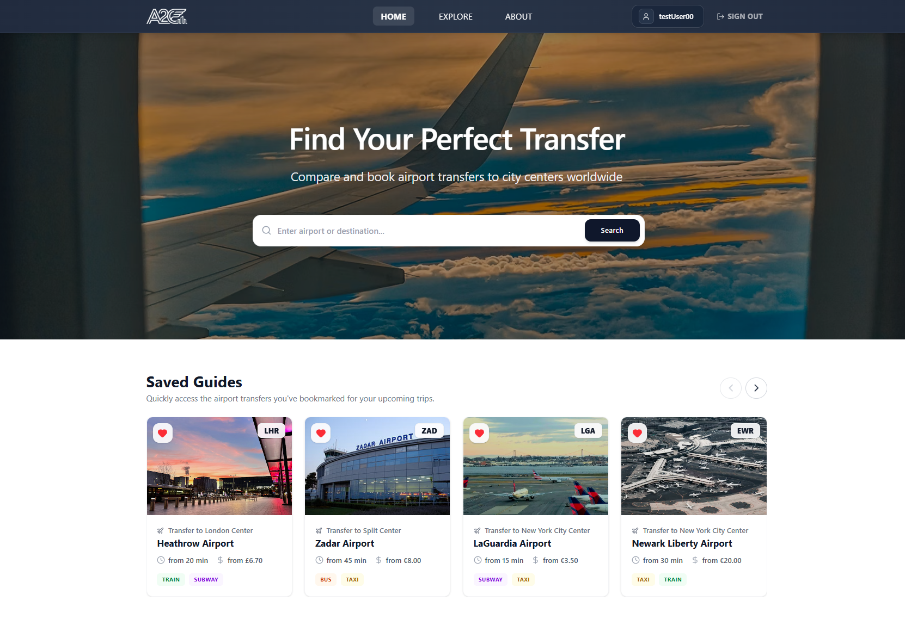

While on specific guide page, users have the ability to switch between different available means of transportation. Tabs with transport methods are color-coded and have a design that clearly shows current state of a tab (active / inactive).

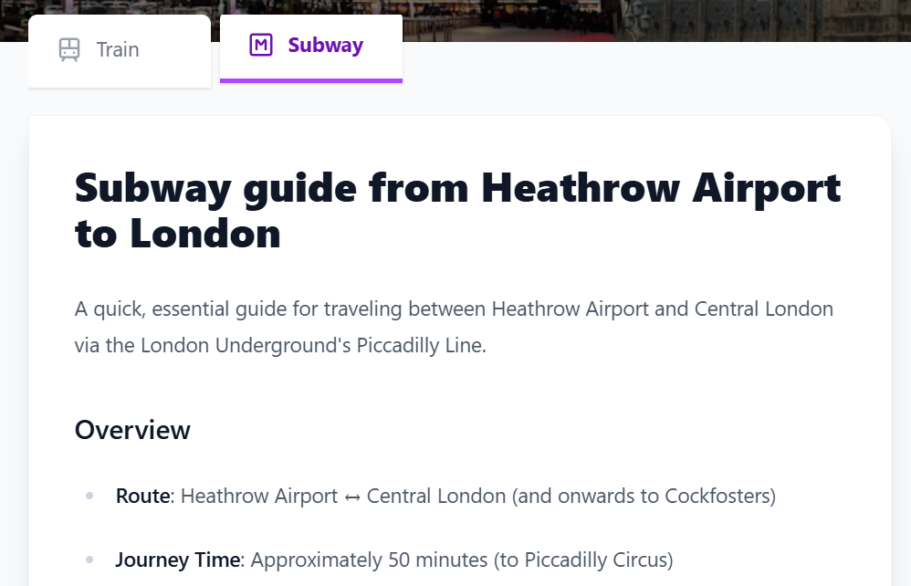

While some features are locked for users that are not logged in, those features are still visible to all users to improve visibility. If an user who is not logged in tries to access one of those features, a log in prompt will pop up. Examples are heart button to add a guide to saved guides, and post an update button that allows registered user to post updates.

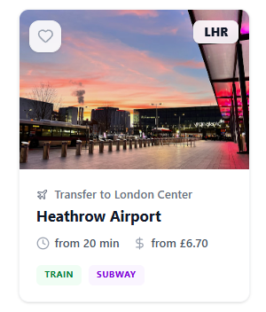 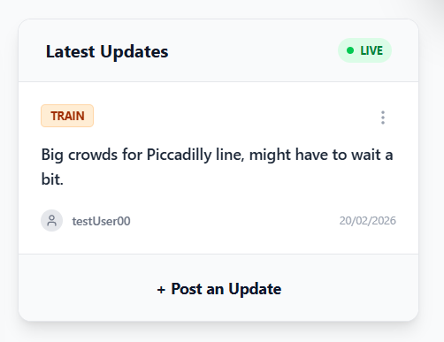

### 2. Feedback
Feedback is the principle of making it clear to the user what action has been taken and what has been accomplished.

When clicked on, a heart icon changes from white to red, indicating that the state has been changed and guide is saved on user profile. Saved guide is instantly displayed on saved guides section and the same applies when user removes the guide from saved.

 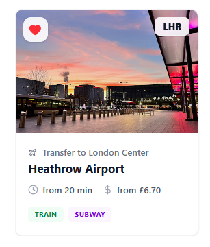

While not logged in, navigation bar displays Sign In button. When user signs in, navigation bar changes state to display user's username and Sign Out button, allowing user to clearly see that the action has been done.

 

Every action regarding updates (post, edit, delete, report) displays success message if action has successfully been performed.

 

Feedback is also given to user when signing in / registering to let him know what needs to be changed, for example:

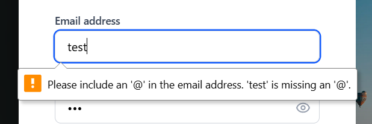

### 3. Constraints

Constraints is about limiting the range of interaction possibilities for the user to simplify the interface and guide the user to the appropriate next action.

Main example of constraints principle in Air2City is when user wants to post an update. Each update needs to have transportation method and text content. Choosing transport method is forced by selecting bus / shuttle as a **default value**, while empty updates are blocked by Post Update button being **greyed out** and **unclickable** while no text is provided.

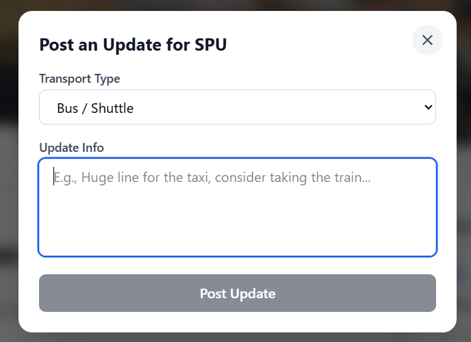 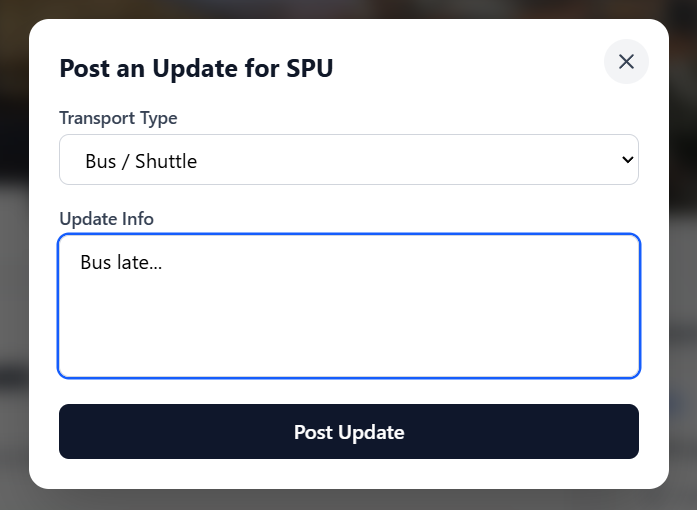

Constraint are also implemented for every field user needs to fill when **signing** in or **registering**. Some of the examples are visible below (also serving as examples of **feedback** principle):

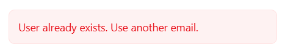 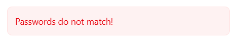 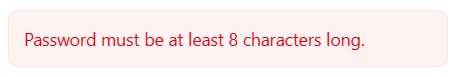

### 4. Mapping

Mapping is about having a clear relationship between controls and the effect they have on the world.

While searching for guides using the search bar, search results are grouped by type (cities and airports) with corresponding icons that indicate what type of search result in displays.

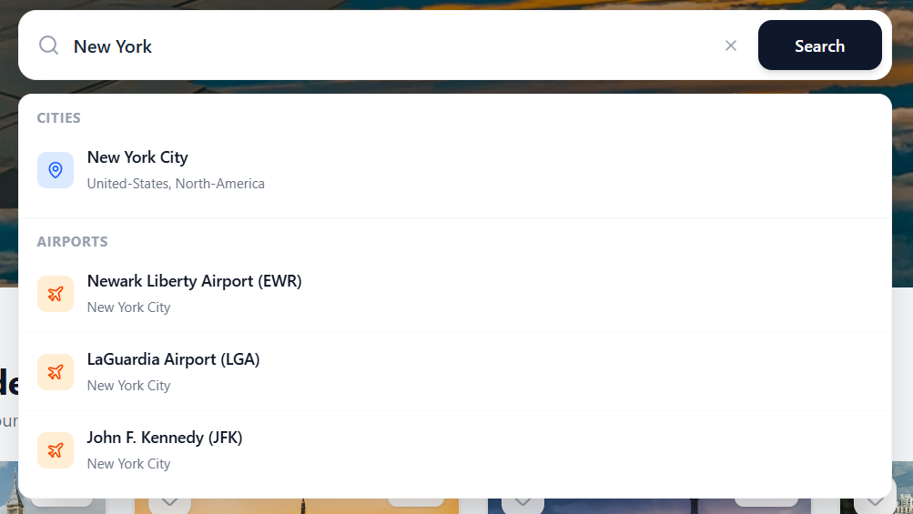

While searching for guides using the Explore section, at each level user can see the whole path that led him to where he currently is and it enables him to directly return to a desired level (world, continent, country, city).

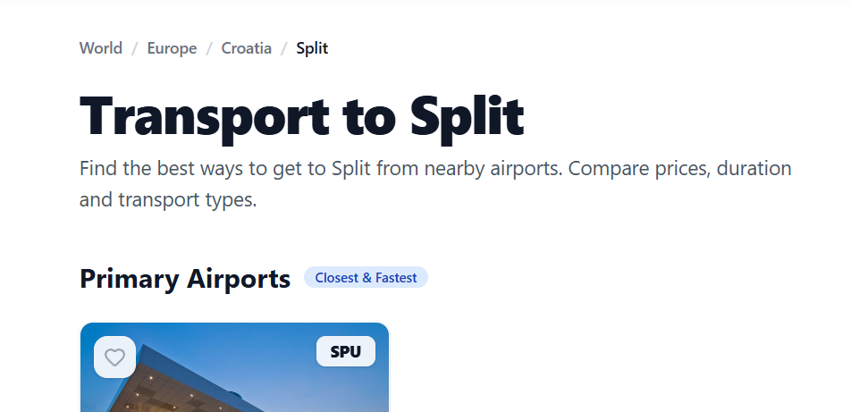

Another example of mapping can be found in Saved Guides section. Guides are grouped in groups of 4 with left and right arrow allowing to display previous or next 4 guides. This can also serve as a **constraints** principle because arrows are greyed out and unclickable if there are no guides availible to display.

Heart icon displayed on each guide card also works as an example of mapping as it indicates the action that will be performed upon clicking (adding guide to favorite / liked / saved) and it is obvious to which guide it applies.

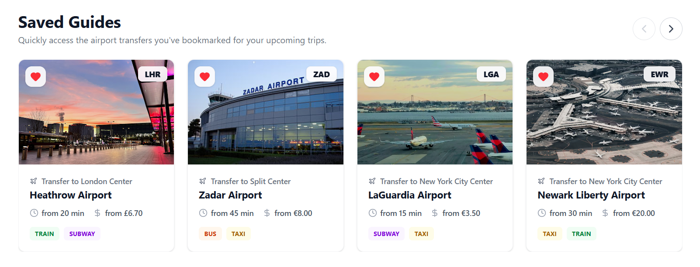

### 5. Consistency

Consistency refers to having similar operations and similar elements for achieving similar tasks.

Every **irreversible action** displays the same **confirmation window** that clearly informs a user about the action that is about to be performed.

 

Button design throughout the whole application is consistent.

  

Card design in Explore section is consistent for every type (continent, country, city).

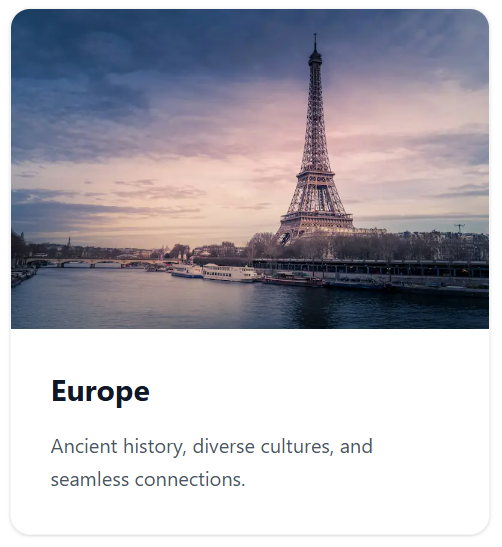 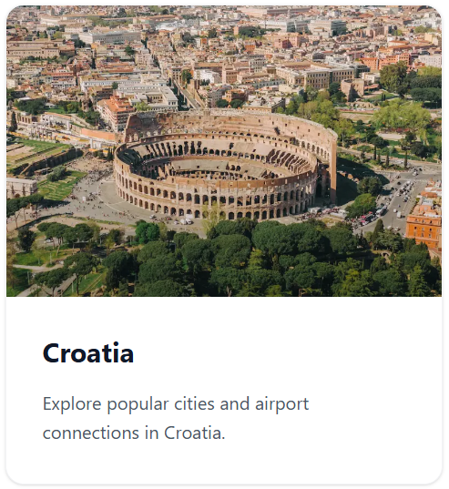 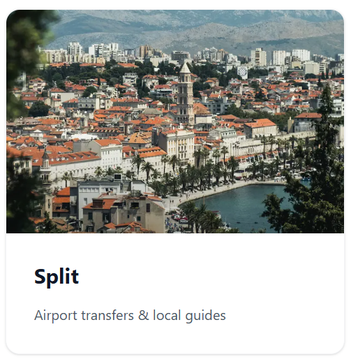

### 6. Affordance / Signifiers

Affordance refers to an attribute of an object that allows people to know how to use it.

Hover effect on every button indicated that a button is clickable.

 

Hover effect on airport and city tags indicate they are clickable.

 

Hover effect and corresponding label indicate that cards are clickable.

 

## Performance analysis